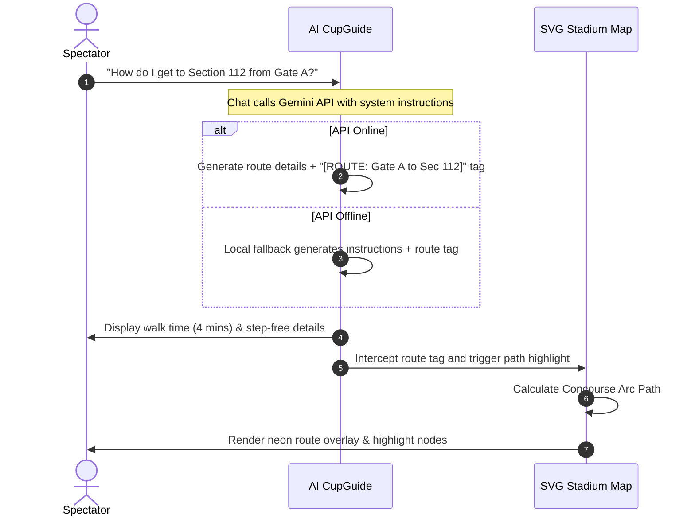
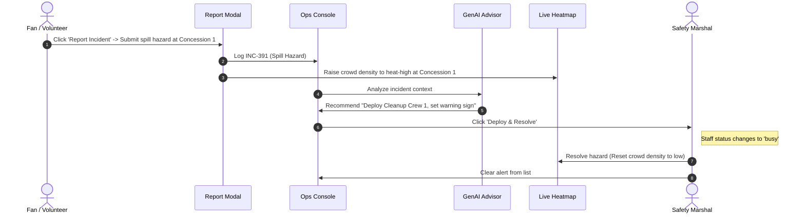

# ArenaIQ: FIFA World Cup 2026 Smart Stadium Operations & Fan Companion

ArenaIQ is a premium, high-fidelity, GenAI-enabled web application dashboard designed for the FIFA World Cup 2026. It features a dual-persona interface that bridges the gap between spectator experience and venue operations.

*   **Fan Companion ("CupGuide 2026")**: Provides interactive wayfinding, smart transit details, multilingual GenAI support, and a gamified sustainability tracker.
*   **Stadium Ops Command Center ("OpsIntel 2026")**: Provides real-time incident console maps, GenAI decision support dispatch, and volunteer staffing metrics.

---

## 🏗️ System Architecture & Data Flow

```mermaid
graph TD
    %% User Actions
    Fan[Fan Portal] -->|Query/Report| ChatBot[GenAI CupGuide Chat]
    Fan -->|Log Action| GreenTracker[Green Fan Challenge]
    Staff[Ops Command] -->|Deploy/Resolve| DispatchConsole[GenAI Dispatch Console]

    %% Front-End Controllers
    ChatBot -->|Fetch Response| GeminiAPI{Gemini API Router}
    GeminiAPI -->|Header Auth| AIStudio[Google AI Studio]
    GeminiAPI -->|Header Auth| VertexAI[Vertex AI Cloud]
    GeminiAPI -->|Fallback| LocalSim[Local Simulation Router]

    %% UI Integrations
    GeminiAPI -->|Parse [ROUTE]| MapController[Concourse Map Controller]
    MapController -->|Update Path| SVGMap[Interactive SVG Map]
    
    DispatchConsole -->|Submit Dispatch| OpsMap[Ops Live Heatmap]
    DispatchConsole -->|Update Status| StaffRoster[Volunteer Deployment Board]

    %% Styling Theme
    classDef main fill:#0d0f1a,stroke:#00f0ff,stroke-width:2px,color:#fff;
    classDef provider fill:#111424,stroke:#00e676,stroke-width:2px,color:#fff;
    classDef fallback fill:#111424,stroke:#ffab00,stroke-width:2px,color:#fff;

    class Fan,Staff,SVGMap main;
    class AIStudio,VertexAI provider;
    class LocalSim fallback;
```

---

## 🗺️ Workflows

### 1. Fan Wayfinding & Smart Routing Workflow



### 2. Incident Reporting & Operational Dispatch Loop



---

## 🌟 Key Features

*   **Dual-Persona Toggle**: Collapsible sidebar enabling instant hot-swapping between the Fan Companion and the Stadium Ops Command Center.
*   **Dual-Endpoint Gemini Integration**: Chatbot attempts authentication via **Google AI Studio** and **Vertex AI** endpoints using standard Bearer tokens. Supports multi-key looping to ensure connection.
*   **Mathematical Concourse Arc Pathfinding**: Dynamically calculates concourse walking paths between any Gate and Section using circle arc calculations.
*   **Real-time Incident Console**: Fully functional report panel for operations dispatch, with staffing allocations, status matrices, and map feedback loops.
*   **Live Dashboard Tickers**:
    *   **Kickoff Countdown Clock**: Ticks down to matchday kickoff in real-time.
    *   **Transit boards & Section congestion**: Background loops simulate fluctuating queue sizes and transit arrival minutes.

---

## 🚀 Installation & Local Run

Since the application is fully self-contained, you can run it locally in two ways:

### Option A: Localhost Server (Vite)
1. In your terminal, navigate to the folder:
   ```bash
   cd f:\aa
   ```
2. Run the Vite command:
   ```bash
   npx vite --port 5173
   ```
3. Open your browser to: **[http://localhost:5173](http://localhost:5173)**

### Option B: Offline File Loading
Double-click `index.html` or drag and drop it into Chrome/Edge to load it directly via:
`file:///f:/aa/index.html`
*(The application contains zero local HTTP/CORS import blocks, meaning chatbot wayfinding and sustainability logs will run perfectly offline).*
